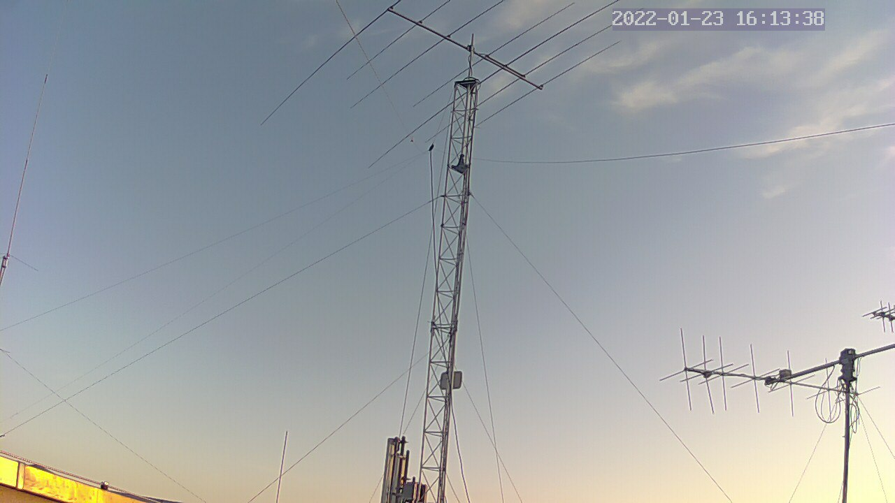
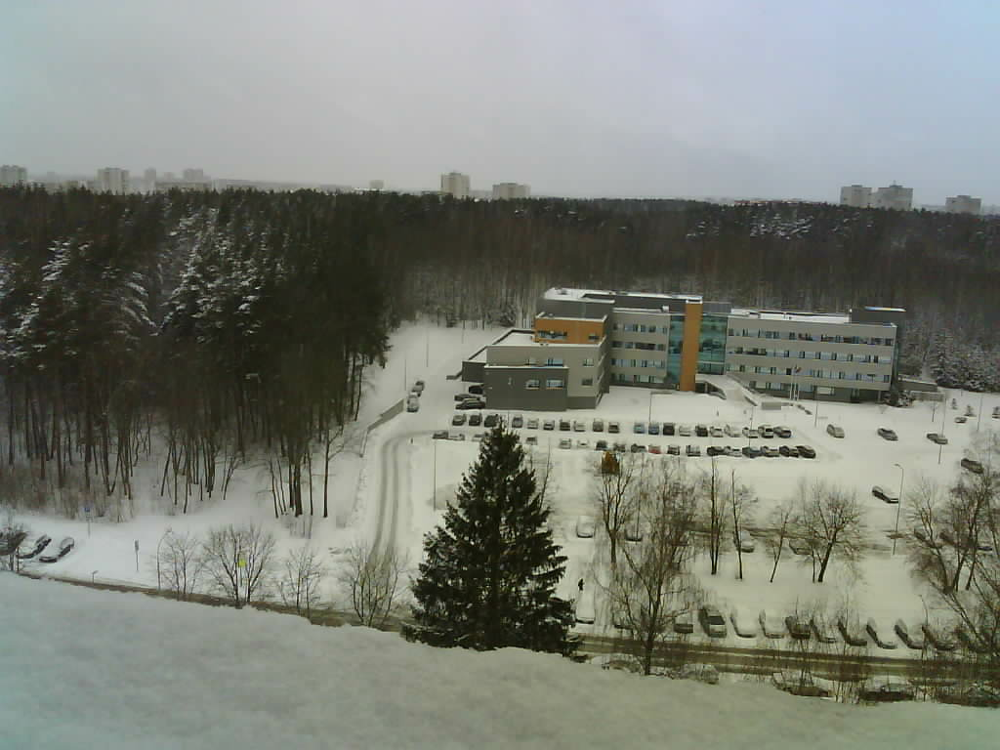

# VU radijo klubo Telegram botas

Sveiki, radijo mėgėjai. Aš esu VU radijo klubo stoties valdymo botas. Mane galite pakalbinti Telegram platformoje, adresu [@ly1bwb_station_bot](https://t.me/ly1bwb_station_bot).

## Boto komandos

* `lower_camera` - Žemesnė stogo kamera
* `roof_camera` - Aukštesnė stogo kamera
* `main_camera` - Patalpos kamera
* `window_camera` - Vaizdas pro langą
* `rig_camera` - VHF (FT847) kamera
* `vhf_freq` - VHF stoties dažnis
* `vhf_azel` - VHF antenų kryptis
* `moon` - Mėnulio azimutas ir elevacija
* `moon_azel` - Nukreipti VHF antenas į Mėnulį (tik nariams)
* `set_vhf_az` - Nustatyti VHF antenų azimutą (tik nariams)
* `set_vhf_el` - Nustatyti VHF antenų elevaciją (tik nariams)
* `set_vhf_freq` - Nustatyti VHF stoties dažnį (tik nariams)
* `set_vhf_mode` - Nustatyti VHF stoties režimą (tik nariams)
* `sveiki` - Sveiki

## Komandų aprašymas

### /main_camera

Patalpų vaizdas plačiu kampu. 

### /window_camera

Vaizdas pro langą vakarų kryptimi. Naudojama ESP32 kamera.

### /set_vhf_az (admin)

Robotas pasuks antenas tam tikru azimutu, kurį nurodote arba kaip komandos parametrą, arba nenurodžius parametro, pasirinksite iš meniu, kurį botas pateiks.

## Autoriai

* Simonas LY2EN <ly2en@qrz.lt>
* Vilius LY3FF (MQTT modulis)
* Domantas LY1JA